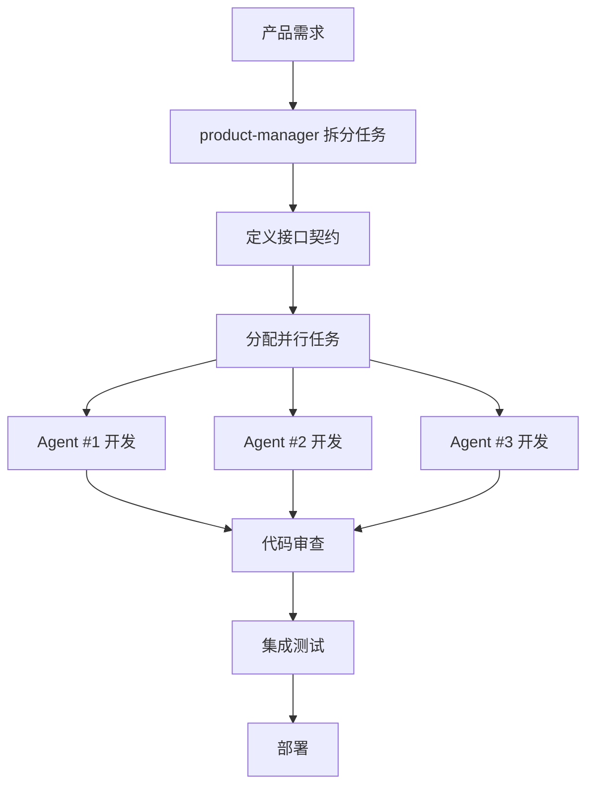

# ArbitrageX 并行开发框架

**版本**: v1.0.0
**创建日期**: 2026-01-08
**维护人**: yangyangyang

---

## 1. 概述

### 1.1 目标

- **提高开发效率**：多 Agent 并行工作，模拟真实团队协作
- **减少依赖等待**：独立任务并行执行
- **专业化分工**：不同 Agent 负责不同领域
- **质量保证**：代码审查和测试提前介入

### 1.2 并行开发原则

1. **任务独立性**：并行任务必须相互独立
2. **接口先行**：先定义接口，再并行实现
3. **频繁集成**：定期合并并行任务的成果
4. **清晰边界**：每个 Agent 有明确的职责边界

---

## 2. Agent 角色定义

### 2.1 核心 Agent

| Agent | 角色 | 主要职责 | 能力 |
|-------|------|----------|------|
| **product-manager** | 产品经理 | 需求分析、技术设计、任务拆分 | 需求澄清、设计文档编写 |
| **go-developer** | Go 开发工程师 | 模块实现、代码编写 | Go 1.21+、go-zero、代码实现 |
| **test-engineer** | 测试工程师 | 单元测试、集成测试 | 测试用例设计、测试覆盖率 |
| **code-reviewer** | 代码审查专家 | 代码质量审查、最佳实践 | 代码规范、性能优化、安全检查 |
| **blockchain-expert** | 区块链专家 | 智能合约、区块链集成 | Solidity、Ethereum、DEX 集成 |
| **security-auditor** | 安全审计专家 | 安全漏洞检测、加密算法 | OWASP、智能合约安全 |
| **performance-optimizer** | 性能优化专家 | 性能分析、瓶颈优化 | 性能调优、并发优化 |
| **devops-engineer** | 运维工程师 | 基础设施、部署 | Docker、Kubernetes、CI/CD |

### 2.2 协作模式

```
主协调 Agent (Claude Code)
    │
    ├─ 产品阶段
    │   └─ product-manager → 需求澄清、技术设计
    │
    ├─ 开发阶段（并行）
    │   ├─ go-developer #1 → 模块 A 实现
    │   ├─ go-developer #2 → 模块 B 实现
    │   ├─ go-developer #3 → 模块 C 实现
    │   └─ blockchain-expert → DEX/智能合约开发
    │
    ├─ 质量保证阶段（并行）
    │   ├─ test-engineer → 测试用例编写
    │   ├─ code-reviewer → 代码审查
    │   └─ security-auditor → 安全检查
    │
    └─ 部署阶段
        └─ devops-engineer → 环境配置、部署
```

---

## 3. Phase 2 并行开发计划

### 3.1 任务拆分

**Phase 2: 基础架构搭建**（预计 1 周）

| 任务编号 | 任务名称 | Agent | 依赖 | 预计时间 |
|---------|---------|-------|------|----------|
| **2.1** | 项目结构初始化 | go-developer #1 | 无 | 2 小时 |
| **2.2** | Docker 环境配置 | devops-engineer | 无 | 2 小时 |
| **2.3** | MySQL 数据库部署 | devops-engineer | 无 | 2 小时 |
| **2.4** | go-zero 配置 | go-developer #1 | 2.1 | 2 小时 |
| **2.5** | 基础 Model 生成 | go-developer #2 | 2.3 | 3 小时 |
| **2.6** | Price_Monitor 框架 | go-developer #1 | 2.4 | 4 小时 |
| **2.7** | Exchange_Adapter 接口 | go-developer #2 | 2.4 | 4 小时 |
| **2.8** | 单元测试框架 | test-engineer | 2.4 | 3 小时 |
| **2.9** | 代码审查 | code-reviewer | 2.6, 2.7 | 2 小时 |
| **2.10** | 集成测试 | test-engineer | 2.6, 2.7 | 3 小时 |

**可并行任务组**：
- **并行组 1**: [2.1, 2.2, 2.3] - 基础环境搭建（3 个 Agent 并行）
- **并行组 2**: [2.5, 2.6, 2.7] - 模块开发（2 个 go-developer 并行）
- **并行组 3**: [2.8, 2.9] - 质量保证（test-engineer 和 code-reviewer 并行）

### 3.2 依赖关系图

```
[2.1 项目结构] ──→ [2.4 go-zero 配置] ──→ [2.6 Price_Monitor] ──→ [2.9 代码审查]
                          │                         │
[2.2 Docker] ─────────────┘                         │
                                                  [2.10 集成测试]
                          │                         │
[2.3 MySQL] ─────────────→ [2.5 基础 Model] ──→ [2.7 Exchange_Adapter] ─┘
                          │
                          └─→ [2.8 单元测试框架]
```

---

## 4. 并行开发工作流

### 4.1 标准流程



### 4.2 接口先行策略

**关键**：在并行开发前，先定义清晰的接口

**示例**：

```go
// internal/common/interfaces/exchange.go
package interfaces

// ExchangeAdapter 交易所适配器接口（所有实现必须遵守）
type ExchangeAdapter interface {
    // 获取价格
    GetTicker(symbol string) (*Ticker, error)

    // 下单
    PlaceOrder(order *Order) (*OrderResult, error)

    // 查询余额
    GetBalance() (*Balance, error)
}

// Ticker 价格数据结构
type Ticker struct {
    Symbol    string
    Price     float64
    Timestamp int64
}

// Order 订单结构
type Order struct {
    Symbol   string
    Side     string // "buy" or "sell"
    Amount   float64
    Price    float64
}

// OrderResult 订单结果
type OrderResult struct {
    OrderID   string
    Status    string
    Timestamp int64
}
```

有了接口定义后：
- `go-developer #1` 实现 Binance 适配器
- `go-developer #2` 实现 OKX 适配器
- `test-engineer` 编写接口测试
- **三者完全并行，互不干扰**

---

## 5. 协调机制

### 5.1 主 Agent 职责

**主 Agent**（Claude Code）负责：

1. **任务拆分**：将大任务拆解为可并行的小任务
2. **Agent 分配**：为每个任务分配合适的 Agent
3. **进度跟踪**：监控所有并行任务的进度
4. **冲突解决**：处理并行任务之间的冲突
5. **结果合并**：将所有 Agent 的成果合并

### 5.2 通信协议

```yaml
# 任务分配协议
TaskAssignment:
  task_id: "2.1"
  agent_type: "go-developer"
  agent_number: 1
  description: "初始化项目结构"
  deliverables:
    - "cmd/price/main.go"
    - "internal/config/config.go"
    - "go.mod"
  dependencies: []
  estimated_time: "2 hours"

# 结果返回协议
TaskResult:
  task_id: "2.1"
  status: "completed"
  files_created:
    - "cmd/price/main.go"
    - "internal/config/config.go"
  notes: "项目结构已按 go-zero 规范初始化"
```

### 5.3 进度跟踪

使用 `.progress.json` 跟踪每个 Agent 的进度：

```json
{
  "parallel_tasks": [
    {
      "task_id": "2.1",
      "name": "项目结构初始化",
      "agent": "go-developer #1",
      "status": "completed",
      "started_at": "2026-01-08 10:00",
      "completed_at": "2026-01-08 12:00",
      "files_created": ["cmd/price/main.go", "internal/config/config.go"]
    },
    {
      "task_id": "2.2",
      "name": "Docker 环境配置",
      "agent": "devops-engineer",
      "status": "in_progress",
      "started_at": "2026-01-08 10:00"
    }
  ]
}
```

---

## 6. 并行开发最佳实践

### 6.1 任务拆分原则

✅ **好的拆分**：
- 任务相互独立
- 每个任务有明确的产出
- 任务时间大致均衡
- 接口定义清晰

❌ **不好的拆分**：
- 任务之间有循环依赖
- 某些任务时间过长
- 接口定义模糊
- 产出不明确

### 6.2 避免冲突

**文件级冲突**：
- 不同 Agent 操作不同的文件/目录
- 使用接口隔离实现

**示例**：
```
项目结构：
arbitragex/
├── cmd/
│   ├── price/          (go-developer #1 负责)
│   ├── engine/         (go-developer #2 负责)
│   └── trade/          (go-developer #3 负责)
├── internal/
│   ├── price/          (go-developer #1 负责)
│   ├── engine/         (go-developer #2 负责)
│   ├── trade/          (go-developer #3 负责)
│   └── common/         (共同使用，接口先行定义)
└── pkg/
    └── exchange/       (go-developer #2 负责)
```

### 6.3 频繁集成

- **每小时**：主 Agent 检查一次并行任务进度
- **每完成一个任务**：立即集成到主分支
- **每日**：进行一次完整的集成测试

---

## 7. Agent 使用示例

### 7.1 启动并行任务

```python
# 伪代码示例
def start_parallel_development():
    # 1. 定义任务
    tasks = [
        {
            "task_id": "2.1",
            "agent": "go-developer",
            "prompt": "初始化项目结构，按照 go-zero 规范创建目录和基础文件",
            "context": "参考 docs/design/Architecture/Module_Structure.md"
        },
        {
            "task_id": "2.2",
            "agent": "devops-engineer",
            "prompt": "配置 Docker 环境，创建 docker-compose.yml",
            "context": "参考 docs/design/Deployment/Docker_Deployment.md"
        },
        {
            "task_id": "2.3",
            "agent": "devops-engineer",
            "prompt": "部署 MySQL 数据库，创建初始化脚本",
            "context": "参考 docs/design/Database/Schema_Design.md"
        }
    ]

    # 2. 并行启动（使用 Task tool 的 run_in_background 参数）
    for task in tasks:
        Task(
            subagent_type=task["agent"],
            prompt=task["prompt"],
            run_in_background=True
        )

    # 3. 等待所有任务完成
    wait_for_all_tasks()
```

### 7.2 实际使用（Claude Code）

```bash
# 主 Agent 启动 3 个并行任务
Task(go-developer, "初始化 go-zero 项目结构", run_in_background=true)
Task(devops-engineer, "配置 Docker 环境", run_in_background=true)
Task(devops-engineer, "部署 MySQL 数据库", run_in_background=true)

# 等待任务完成
# 然后使用 TaskOutput 获取结果
```

---

## 8. 实战案例：Phase 2 并行开发

### 8.1 第一轮并行（2 小时）

**任务组 1：基础环境搭建**

| Agent | 任务 | 产出 |
|-------|------|------|
| go-developer #1 | 项目结构初始化 | `cmd/`, `internal/`, `go.mod` |
| devops-engineer | Docker 配置 | `docker-compose.yml`, `Dockerfile` |
| devops-engineer | MySQL 部署 | 数据库初始化脚本 |

**并行启动**：
```
主 Agent: 同时启动 3 个 background tasks
等待 2 小时
检查 3 个任务结果
```

### 8.2 第二轮并行（4 小时）

**任务组 2：模块开发**

| Agent | 任务 | 产出 |
|-------|------|------|
| go-developer #1 | Price_Monitor 模块 | `internal/price/` |
| go-developer #2 | Exchange_Adapter 接口 | `internal/exchange/` |
| test-engineer | 单元测试框架 | `*_test.go` |

**依赖**：等待第一轮完成

### 8.3 第三轮并行（2 小时）

**任务组 3：质量保证**

| Agent | 任务 | 产出 |
|-------|------|------|
| code-reviewer | 代码审查 | 审查报告 |
| test-engineer | 集成测试 | 测试报告 |
| performance-optimizer | 性能优化 | 优化建议 |

---

## 9. 工具和脚本

### 9.1 并行任务管理脚本

```bash
#!/bin/bash
# scripts/parallel-dev.sh

# 启动并行任务
echo "启动并行开发任务..."

# Task 1: 项目结构
echo "Task 1: go-developer #1 初始化项目结构"
# (调用 Claude Code Task tool)

# Task 2: Docker 配置
echo "Task 2: devops-engineer 配置 Docker"
# (调用 Claude Code Task tool)

# Task 3: MySQL 部署
echo "Task 3: devops-engineer 部署 MySQL"
# (调用 Claude Code Task tool)

# 等待所有任务完成
echo "等待所有任务完成..."
wait

echo "并行任务完成！"
```

### 9.2 进度监控

```bash
#!/bin/bash
# scripts/monitor-progress.sh

# 检查并行任务进度
echo "=== 并行任务进度 ==="

# 读取 .progress.json
jq '.parallel_tasks' .progress.json | while read -r task; do
    task_id=$(echo $task | jq -r '.task_id')
    agent=$(echo $task | jq -r '.agent')
    status=$(echo $task | jq -r '.status')

    echo "[$task_id] $agent - $status"
done
```

---

## 10. 总结

### 10.1 并行开发优势

- ⚡ **效率提升**：3 个 Agent 并行 = 3 倍速度
- 🎯 **专业化**：每个 Agent 专注自己擅长的领域
- 🔄 **快速迭代**：频繁集成，快速反馈
- 🛡️ **质量保证**：test-engineer 和 code-reviewer 提前介入

### 10.2 关键成功因素

1. **接口先行**：先定义接口，再并行实现
2. **任务独立**：避免任务之间的依赖
3. **频繁集成**：定期合并成果
4. **清晰沟通**：每个任务有明确的输入产出

### 10.3 下一步

开始 Phase 2 并行开发：

1. ✅ 定义接口契约
2. ✅ 拆分任务为可并行的小任务
3. ✅ 分配 Agent
4. ✅ 启动并行开发
5. ✅ 监控进度
6. ✅ 集成成果

---

**文档版本**: v1.0.0
**最后更新**: 2026-01-08
**状态**: 准备就绪，可以开始并行开发
